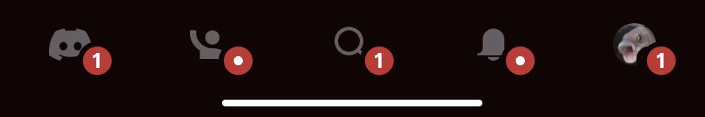
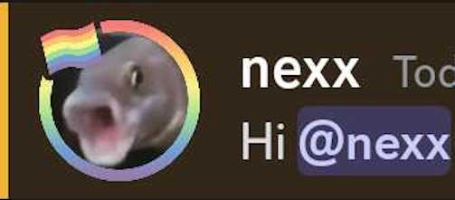
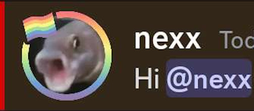

<div align="center">
	<a href="https://github.com/Gabe616/VendettaThemesPlus/stargazers">
		
	</a>
	<a href="https://github.com/Gabe616/VendettaThemesPlus/issues">
		
	</a>
	<a href="https://github.com/Gabe616/VendettaThemesPlus/issues">
		
	</a>
	<a href="https://discord.gg/n9QQ4XhhJP">
		
	</a>
</div>
<div align="center">
    <h1>🎨 Vendetta Themes+</h1>
</div>

## Table of Contents

- [Vendetta Themes+](#-vendetta-themes)
  - [Table of Contents](#table-of-contents)
  - [Info](#info)
  - [Links](#links)
  - [Examples](#examples)
  - [Using Vendetta Themes+](#using-vendetta-themes)
    - [Custom Icon Colors](#custom-icon-colors)
    - [Unread Badge Color](#unread-badge-color)
    - [Custom Icon Overlays](#custom-icon-overlays)
  - [Mention Line Color](#mention-line-color)
  - [The Color System](#the-color-system)

## Info

The latest structure version of Vendetta Themes+ is `0`

Vendetta Themes+ is a plugin that adds more customizability to themes, such as:

- recoloring icons ([completely](#custom-icon-colors), [unread badges](#unread-badge-color), and [seperate layers](#custom-icon-overlays))

Users must install this [**plugin**](https://github.com/Gabe616/VendettaPlugins/tree/main/plugins/themes-plus) in order to see Vendetta Themes+ in action.  
It's recommended to include this message (or something similiar to it) wherever you're promoting your themes:

> This theme uses Themes+, install it here: [**Themes+**](https://discord.com/channels/1015931589865246730/1033532783659847710/1093646560128151643)

## Links

- [This repository](https://github.com/Gabe616/VendettaThemesPlus)
- [Plugins channel link](https://discord.com/channels/1015931589865246730/1033532783659847710/1093646560128151643) (doesn't exist yet)
- [Plugin link](https://gabe616.github.io/VendettaPlugins/themes-plus)
- [Plugin source code](https://github.com/Gabe616/VendettaPlugins/tree/main/plugins/themes-plus)

## Examples

- [MonetTheme](https://github.com/Gabe616/VendettaMonetTheme/)

## Using Vendetta Themes+

Using Vendetta Themes+ is as easy as adding this property to your theme.  
Structure:

- `plus` — object, contains everything
  - version — number, used for backwards compability

Example:

```json
"plus": {
	"version": 0
}
```

### Custom Icon Colors

Recolors icons. (this changes the color of the icon _completely_!)  
Structure:

- `icons` — object, contains all the icons
  - key — string, codename of an asset (or a [custom icon overlay](#custom-icon-overlays))
  - value — [color](#the-color-system)

Example:

```json
"plus": {
	"version": 0,
	"icons": {
		"ic_new_pins": [
			"#FAA",
			"#AFA",
			"#AAF",
			"#FAF"
		],
		"emoji": [
			"#AFF"
		]
	}
}
```

Would look like:

| Original                                     | Dark                                     | Light                                     | Amoled                                     | Darker                                     |
| -------------------------------------------- | ---------------------------------------- | ----------------------------------------- | ------------------------------------------ | ------------------------------------------ |
|  |  |  |  |  |
|        |        |     |          |          |

### Unread Badge Color

Changes the color of the unread badge indicator.
Structure:

- `unreadBadgeColor` — [color](#the-color-system)

Example:

```json
"plus": {
	"version": 0,
	"unreadBadgeColor": "#FFA"
}
```

Would look like:

| Original                                      | Recolored                                      |
| --------------------------------------------- | ---------------------------------------------- |
|  |  |

### Custom Icon Overlays

Adds extra customizable layers to icons. [**Here's the full list**](./CUSTOM_ICON_OVERLAYS.md)

Structure:

- `customOverlays` — boolean, whether custom icon overlays are enabled

Example:

```json
"plus": {
	"version": 0,
	"unreadBadgeColor": "#FAF",
	"icons": {
		"ic_radio_square_checked__overlay": "#FFA"
	},
	"customOverlays": true
}
```

Would look like:

| Original                                                          | Recolored                                                          |
| ----------------------------------------------------------------- | ------------------------------------------------------------------ |
|              |              |
|  |  |

### Mention Line Color

Recolors the line next to a message where you were mentioned

Structure:

- `mentionLineColor` — [color](#the-color-system)

Example:

```json
"plus": {
	"version": 0,
	"mentionLineColor": "#F00"
}
```

Would look like:

| Original                                      | Recolored                                      |
| --------------------------------------------- | ---------------------------------------------- |
|  |  |

## The Color System

A color can be:

- An array of strings, representing a hex code for each theme in this order: **dark, light, amoled, darker** (only the first color is required)
- A string, representing a RawColor that applies to all themes (must begin with `RC_`) ([list of all RawColors](https://github.com/Gabe616/VendettaThemeUtil/blob/main/colors/latest/RawColors.json))
- A string, representing a SemanticColor that applies to the current theme (must begin with `SC_`) ([list of all SemanticColors](https://github.com/Gabe616/VendettaThemeUtil/blob/main/colors/latest/SemanticColors.json))
- A string, a hex code for each theme

Example: (assuming an unthemed client with dark mode)

| Color                      | Preview                         |
| -------------------------- | ------------------------------- |
| `["#FAA", "#AFA", "#AAF"]` |   |
| `RC_SPOTIFY`               |  |
| `SC_TEXT_LINK`             |   |
| `#FAF`                     |  |
