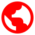
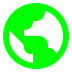
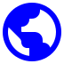
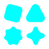
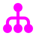
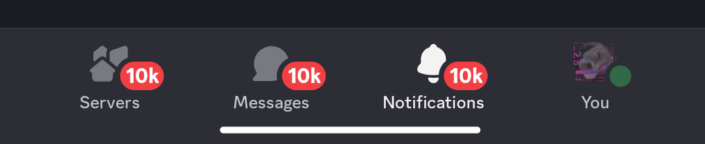
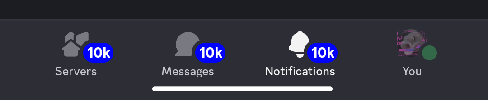
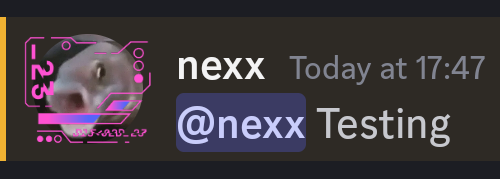
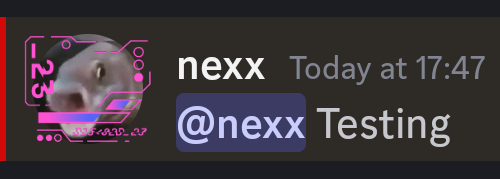
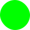

# Plus Version 0

## Custom Icon Colors

Allows you to recolor icons, or their layers if [custom icon overlays](#custom-icon-overlays) is enabled  
Structure:

- `icons` — an object containing all the icon recolors
  - key — name of an icon
  - value — a [color](#the-color-system)

Example:

```json
"plus": {
    "version": 0,
    "icons": {
        "GlobeEarthIcon": [
            "#f00",
            "#0f0",
            "#00f"
        ],
        "AppsIcon": [
            "#0ff"
        ],
        "HubIcon": "#f0f"
    }
}
```

Would look like:

| Original                                                | Dark                                            | Light                                             | Midnight                                                |
| ------------------------------------------------------- | ----------------------------------------------- | ------------------------------------------------- | ------------------------------------------------------- |
|  |  |  |  |
|        |        |     |            |
|         |          |           |              |

## Unread Badge Color

> [!WARNING]
> This is deprecated and will be removed in version 1. Use raw color `RED_400` instead

Changes the color of the unread badge  
Structure:

- `unreadBadgeColor` — a [color](#the-color-system)

Example:

```json
"plus": {
    "version": 0,
    "unreadBadgeColor": "#00f"
}
```

Would look like:

| Original                                              | Recolored                                               |
| ----------------------------------------------------- | ------------------------------------------------------- |
|  |  |

## Custom Icon Overlays

> [!NOTE]
> Incompatible with iconpacks

Adds more layers to icons to allow futher recoloring. You can find the full list [here](./CUSTOM-ICON-OVERLAYS.md)  
Structure:

- `customOverlays` — a boolean

Example:

```json
"plus": {
    "version": 0,
    "icons": {
        "ic_radio_square_checked_24px": ["#f00", "#f0f"],
        "ic_radio_square_checked_24px__overlay": ["#faa", "#faf"],
        "ic_radio_circle_checked_green": ["#aa0", "#0aa"],
        "ic_radio_circle_checked_green__overlay": ["#ffa", "#aff"],
    },
    "customOverlays": true
}
```

Would look like:

| Original                                                                   | Dark                                                               | Light                                                                |
| -------------------------------------------------------------------------- | ------------------------------------------------------------------ | -------------------------------------------------------------------- |
|  |  |  |
|                 |                 |                 |

## Mention Line Color

Recolors the line next to a message where you were mentioned

Structure:

- `mentionLineColor` — a [color](#the-color-system)

Example:

```json
"plus": {
    "version": 0,
    "mentionLineColor": "#f00"
}
```

Would look like:

| Original                                              | Recolored                                               |
| ----------------------------------------------------- | ------------------------------------------------------- |
|  |  |

## Iconpack

Changes how icons look. You can find the full list of iconpacks [here](./ICONPACKS.md)

Structure:

- `iconpack` — the ID of the iconpack

Example:

```json
"plus": {
    "version": 0,
    "iconpack": "solar"
}
```

Would look like:

| Original Icons                                                                                                                                                                | MD3                                                                                                                                                     | Solar                                                                                                                                                                                         |
| ----------------------------------------------------------------------------------------------------------------------------------------------------------------------------- | ------------------------------------------------------------------------------------------------------------------------------------------------------- | --------------------------------------------------------------------------------------------------------------------------------------------------------------------------------------------- |
|  |  |  |
|               |         |               |
|             |       |              |

## The Color System

A color value can either be:

- An array of strings, each entry recoloring a theme in this order:

  - dark/darker **(required)**
  - light
  - midnight

- A string, a **#HEX** color for every theme

Example:

| Color                      | Dark                                | Light                                 | Midnight                            |
| -------------------------- | ----------------------------------- | ------------------------------------- | ----------------------------------- |
| `["#f00", "#0f0", "#00f"]` |      |    |    |
| `["#f0f", "#ff0"]`         |    |  |    |
| `["#0ff"]`                 |    | **unchanged**                         |    |
| `"#fff"`                   |  |    |  |
